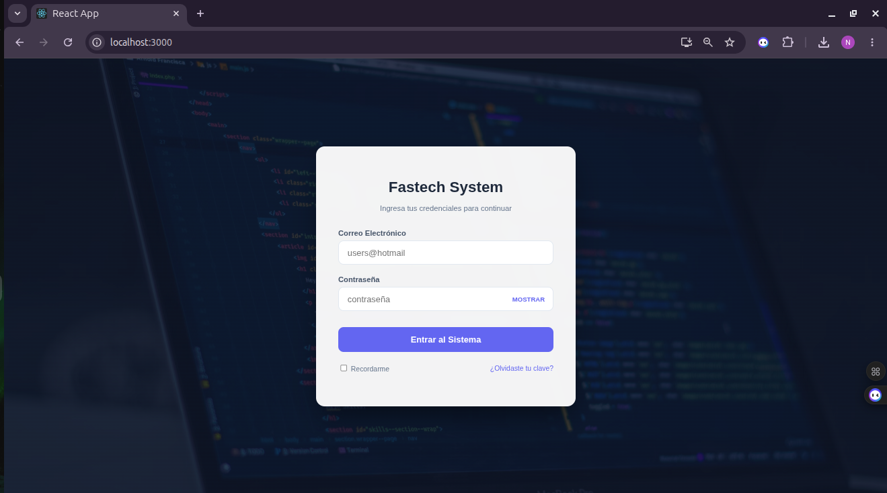
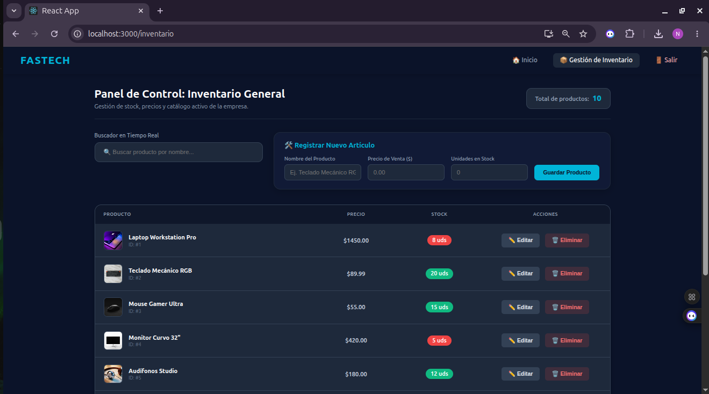
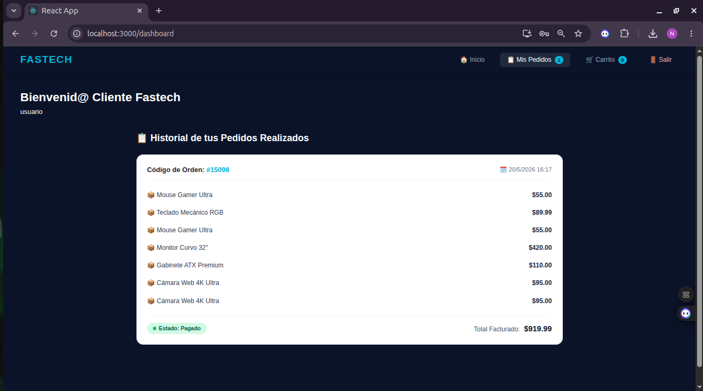

# 🚀 Fastech - Sistema de Gestión Empresarial (ERP)

Fastech es una solución integral de software diseñada para la administración y control de inventarios empresariales. Este sistema centraliza la gestión de productos, permitiendo a los administradores mantener un catálogo actualizado, realizar operaciones de mantenimiento (CRUD) y obtener una visión clara del stock disponible con una interfaz moderna y responsiva.

---

## 📸 Funcionamiento del Sistema

Aquí puedes visualizar el diseño y la funcionalidad del sistema:

### 1. Login de sesion (Administradores - Usuarios)
*Acceso seguro y autenticado para usuarios y administradores.*

### 2. Panel de Inicio Administrador
*Vista de control central con acceso rápido a todas las funcionalidades.*

### 3. Gestión de Inventario (Administración)
*Interfaz para el control total de productos, con edición y eliminación en tiempo real.*

### 4. Panel de Inicio Usuario 
*Interfaz intuitiva para la exploración de artículos.*

### 5. Historial de Pedidos Realizados
*Registro detallado de transacciones anteriores para trazabilidad.*

---

## 🛠️ Especificaciones Técnicas

### Arquitectura
El proyecto sigue un patrón **Cliente-Servidor**:
* **Frontend:** Desarrollado en **React.js**. Utiliza hooks (`useState`, `useEffect`) para la manipulación de estados y una comunicación fluida con la API.
* **Backend:** Servidor en **Node.js** con **Express**, gestionando las peticiones HTTP y la lógica de negocio.
* **Base de Datos:** **MariaDB/MySQL**, donde reside toda la persistencia de datos (productos, precios y stock).

### Flujo de Datos
El sistema utiliza peticiones asíncronas (`fetch` / `async-await`) para asegurar que la interfaz de usuario no se bloquee mientras se procesan los datos en el servidor, garantizando una experiencia de usuario rápida y fluida.

---

## 🌟 Funcionalidades Clave

* **CRUD Completo:** Creación, Lectura, Actualización y Eliminación de productos con validaciones de seguridad.
* **Validación de Datos:** Sistema de alertas personalizadas para evitar errores de entrada (precios negativos, campos vacíos, etc.).
* **Diseño UI/UX "Dark Mode":** Estilos CSS enfocados en la legibilidad y la estética profesional, utilizando efectos de *blur* y *glassmorphism*.
* **Confirmación de Seguridad:** Ventanas modales integradas antes de realizar operaciones destructivas (borrado de datos), 

---

## ⚡ Características Principales
* **Gestión de Stock Dinámica:** Actualización en tiempo real con alertas de validación para prevenir errores de inventario.
* **UX/UI Premium:** Interfaz oscura, elegante, con sombras y animaciones sutiles.
* **Seguridad de Datos:** Validación estricta en el formulario (campos obligatorios, precios > 0, stock no negativo).
* **Búsqueda Inteligente:** Filtros en tiempo real para encontrar productos instantáneamente.
* **Sistema de Alertas:** Notificaciones personalizadas (éxito/error) que mejoran la comunicación con el administrador.

---

